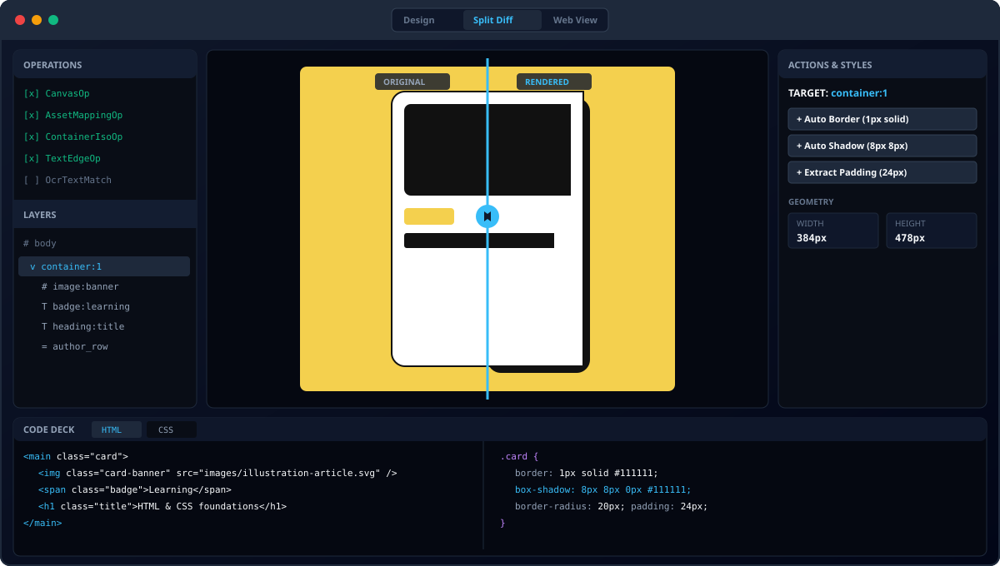

# 🤖 Pixel Agent

Pixel Agent is a desktop application for recreating web pages from visual references.

The application combines a C# desktop host with a browser-based rendering environment, allowing generated HTML and CSS to be rendered and inspected directly inside the application.



## ✨ What is Pixel Agent?

Pixel Agent is being built around the idea of turning a visual representation of a web page into a structured, editable web implementation.

The long-term workflow is:

Image → Analysis → Structured representation → HTML/CSS

The application will eventually use AI to analyze screenshots and identify the visual structure of a page, including elements, positioning, colors, typography, images, and other styling properties.

## 🖥️ Desktop Application

Pixel Agent is a Windows desktop application built with:

- C#
- Windows Forms
- Microsoft WebView2
- HTML/CSS
- JavaScript

WebView2 provides the browser rendering environment used by Pixel Agent, allowing HTML and CSS to be rendered using the Chromium-based Microsoft Edge rendering engine.

## 🚧 Project Status

Pixel Agent is currently in early development.

The current application establishes the desktop foundation and browser rendering environment. AI-powered page analysis and reconstruction will be introduced incrementally as the project develops.

## 🎯 Goals

The project aims to eventually support:

- 🖼️ Analyze screenshots of web pages
- 🧩 Identify page sections and components
- 📐 Determine element dimensions and positioning
- 🎨 Extract colors, shadows, borders, and other visual properties
- 🔤 Identify typography and text hierarchy
- 🖼️ Detect and place visual assets
- 🌐 Generate structured HTML and CSS
- 🔍 Render and inspect the generated page inside the application

## 📁 Project Structure

The repository is organized around the desktop application, AI components, assets, and development tooling.

```text
pixel-agent/
├── PixelAgent/     # C# desktop application
├── agents/         # AI agents
├── model/          # Model-related code
├── assets/         # Project assets
├── scripts/        # Development utilities
└── tests/          # Tests
```

